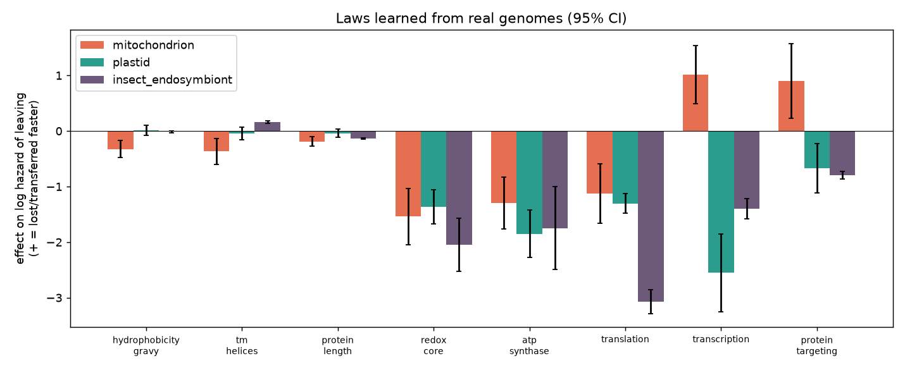

# organelle-evo

**공생 세균이 미토콘드리아가 되고 자유생활 생물이 기생충이 될 때, 유전체는 무엇을 남기고 무엇을 버릴까.**
실제 유전체 약 150개에서 그 규칙을 학습하고, 규칙이 어디까지 통하는지 검증한 개인 연구 프로젝트입니다.

> *Learning which genes survive genome reduction, in endosymbiont-to-organelle and free-living-to-parasite transitions, from ~150 real genomes, and testing where those rules stop working.*

| | |
|---|---|
| 데이터 | 공생체·소기관 유전체 64개, 진핵생물 87종 (Pfam 유전자군 11,162개, 비교 쌍 67개) |
| 모델 | 경쟁위험 보존 모형, 선형 birth-death 과정, 시뮬레이션 기반 추론, Wagner 절약법, 베이즈 역추적 |
| 결과물 | 버전 관리되는 법칙 저장소(`laws/`), 연구 요약 도식, 브라우저에서 돌아가는 조상 역추적기 |
| 검증 | 계통을 빼고 맞히기(leave-one-out, 5-fold), 기준선·암기 모델과 비교, 테스트 54개 |

## 핵심 결과



1. **에너지와 번역 장치는 어디서나 끝까지 남는다.** 미토콘드리아, 엽록체, 곤충 공생세균 모두에서 전자전달, ATP 합성효소, 리보솜 유전자가 가장 강하게 보존됩니다.
2. **RNA 중합효소는 시스템마다 정반대다.** 미토콘드리아는 세균형 RNA 중합효소를 버리고(+1.02), 엽록체는 가장 강하게 지킵니다(−2.55). 실제 진화 역사와 같은 방향이고, 모델에 알려주지 않은 사실입니다.
3. **에너지 유전자를 버리는 원인은 기생이 아니라 미토콘드리아 퇴화다.** 기생을 "기생 · 세포 안 · 미토콘드리아 퇴화" 세 축으로 나누면 전자전달 유전자 소실이 미토콘드리아 퇴화(+1.54 ± 0.35)에서 온다는 것이 분리됩니다. 나눈 모델이 데이터를 훨씬 잘 설명합니다(ΔAIC 368).
4. **유전체 하나로 조상을 역추적할 수 있다.** 현대 기생생물 유전체만 보고 자유생활 조상의 유전자군을 AUROC 0.78로 복원합니다.
5. **얼마나 잃는지는 생활 방식의 덧셈이다.** 조상 유전자군 중 잃는 비율이 자유생활 10% → 세포 밖 기생 27% → 세포 안 38% → 세포 안 + 미토콘드리아 퇴화 73%로, 축의 효과를 더해 예측됩니다.
6. **잃는 순서는 계통을 넘어 같다.** 서로 다른 계통의 기생생물 1,034쌍 모두에서, 더 줄어든 쪽이 덜 줄어든 쪽이 잃은 유전자군을 무작위의 1.58배로 함께 잃었습니다.
7. **유전자군은 거의 독립적으로 사라지고, 예외는 편모다.** 함께 사라지는 모듈을 넣어도 예측이 나아지지 않습니다(+0.001). 뚜렷한 예외는 편모 축사로, 미포자충·타일레리아·말라리아 원충이 한꺼번에 잃고 편모로 헤엄치는 트리파노소마는 지킵니다.
8. **기생생물이 늘리는 것은 영양 수송체다.** 기생생물은 유전자군을 덜 늘리지만, 아미노산 수송체는 9개 계통 중 5곳에서 독립적으로 늘어났습니다.

### 현재 수준 (정직한 숫자)

| 과제 | 점수 | 비교 |
|---|---|---|
| 시뮬레이션에서 숨긴 법칙 되찾기 | 계수 오차 < 0.25 | |
| 처음 보는 소기관이 남긴 유전자 맞히기 | AUROC 0.85 | 유전자별 암기 0.92 |
| 처음 보는 기생생물이 잃는 유전자군 맞히기 | AUROC 0.78 (특성 8개일 때 0.67) | 복제 수 기준선 0.64, 암기 0.87 |
| 처음 보는 **계통** 전체를 빼고 맞히기 | AUROC 0.777 | 암기 0.802 (계통 안에서는 0.865) |
| 유전체 하나로 조상 복원 | AUROC 0.78 | 사전 지식만 0.77 |

유전자군을 묘사하는 특성을 8개에서 56개(GO 기능, Pfam 클랜, 기능 키워드, 자유생활 종에서의 흔한 정도)로 늘리자 처음 보는 기생생물 예측이 0.67에서 0.78로 올랐습니다(`scripts/run_features.py`). 아직 유전자군별 소실 빈도를 외우는 기준선(0.87)보다는 낮습니다. 다만 계통 하나를 통째로 빼면 암기는 0.80으로 떨어지고 법칙은 0.78로 거의 그대로입니다. 법칙이 특정 유전자군이 아니라 **어떤 종류의** 유전자군이 사라지는지를 배웠고, 그 규칙이 독립적으로 기생이 생겨난 계통들 사이에서 공유된다는 뜻입니다.

## 둘러보기

- **조상 역추적기** (`results/reverse_app.html`): 생물과 생활 방식을 고르면 브라우저 안에서 조상의 유전자군을 추정합니다. Python 구현과 1e-9까지 일치하는 JS 포트입니다.
- **진화 법칙 지도** (`results/atlas.html`): 모든 법칙을 한 장에 모은 요약 도식입니다.
- **포트폴리오 소개** (`docs/portfolio.html`): 문제, 접근, 결과, 실패와 배운 것을 정리한 케이스 스터디입니다.
- **연구 일지** (`docs/RESEARCH_LOG.md`): 단계별 실험과 결과 전체입니다.

## 파이프라인

```
1 시뮬레이션        숨긴 법칙으로 유전체 축소를 시뮬레이션 → 학습기가 되찾는지 확인
2 데이터 수집       NCBI 유전체 → GitHub Actions에서 받아 저장소에 커밋
3 유전자 짝짓기     이름 + 단백질 유사도(HMMER 양방향 최고 일치), 진핵생물은 Pfam 계열 계수
4 법칙 학습         보존 위험도 모델 / 복제·소실 birth-death 모델 (PyTorch)
5 검증             계통 빼고 맞히기, 기준선·암기 비교, 정답이 새지 않게 설계
6 역추적과 공개     법칙을 거꾸로 적용해 조상 복원, 브라우저용 체험 페이지
```

## 법칙 저장소

학습한 법칙은 `laws/`에 계수, 95% 신뢰구간, 데이터 출처, **적용 범위**와 함께 버전별로 저장됩니다. 이후 분석은 이전 법칙을 학습에 섞지 않고, 비교 대상이나 기준 예측기로만 씁니다.

| id | 적용 범위 |
|---|---|
| `endosymbiosis_v1` | 의무적 공생에서의 유전체 축소 (소기관, 곤충 공생세균) |
| `eukaryote_lifestyle_v1` | 진핵생물 유전자군 복제·소실, 자유생활 vs 기생 |
| `eukaryote_axes_v1` | 기본 + 기생 / 세포 안 / 미토콘드리아 퇴화 효과 |
| `composite_v1` | 조상 역추적용 복합 법칙 (검증으로 선택) |
| `eukaryote_axes_v3` | 축별 법칙, 유전자군 특성 56개 |
| `severity_v1` | 계통이 조상 유전자군을 얼마나 잃는가 |
| `loss_order_v1` | 잃는 순서의 계통 간 일치 |
| `coloss_modules_v1` | 함께 사라지는 유전자군 모듈 |
| `convergent_expansion_v1` | 여러 계통에서 독립적으로 늘어나는 유전자군 |

## 실행

```bash
pip install -e ".[dev]"
pytest                                   # 테스트 54개

python scripts/run_pipeline.py           # 시뮬레이션: 법칙 학습 → 추론 → 예측
python scripts/run_systems.py            # 미토콘드리아 / 엽록체 / 곤충 공생세균 시뮬레이션
python scripts/run_realdata.py           # 실제 공생체 유전체 64개 (data/raw)
python scripts/run_eukaryote_axes.py     # 진핵생물 축별 법칙 (data/eukaryotes)
python scripts/run_reverse.py            # 조상 역추적 검증
python scripts/run_features.py           # 특성 8개 vs 56개
python scripts/run_severity.py           # 얼마나 잃나
python scripts/run_loss_order.py         # 어떤 순서로 잃나
python scripts/run_modules.py            # 함께 잃나
python scripts/run_expansion.py          # 무엇을 늘리나
python scripts/build_atlas.py            # 요약 도식
python scripts/build_reverse_app.py      # 역추적기 페이지
```

데이터 수집은 GitHub Actions가 합니다: `fetch-data.yml`(공생체 유전체), `eukaryote-pfam.yml`(진핵생물 Pfam 프로필), `family-annotations.yml`(GO·클랜 주석).

## 구조

```
src/organelle_evo/
  simulator.py, rules.py, inference.py, predict.py   시뮬레이션과 법칙 학습·추론·예측
  realdata/     GenBank 파싱, 유사도 기반 유전자 짝짓기, 서열 특성
  eukaryotes/   단백질 수집, Pfam 계수, birth-death 모델, 조상 복원, 역추적, 특성 풍부화
  laws.py       법칙 저장소 읽기·쓰기
scripts/        실험과 페이지 빌드
laws/           버전별 법칙
results/        그림, 지표, 페이지
docs/           포트폴리오 소개, 연구 일지
```

## 한계

- 찾은 것은 인과가 증명된 법칙이 아니라 통계적 경향입니다.
- 가까운 종들을 서로 독립으로 취급해 신뢰구간이 실제보다 좁습니다. 계통수 기반 모델이 다음 과제입니다.
- 조상 대신 현생 친척 종을 조상 대리로 씁니다.
- 역추적 성능의 대부분은 "흔한 유전자는 원래 있었다"는 사전 지식에서 나오고, 법칙이 더하는 몫은 작습니다.
