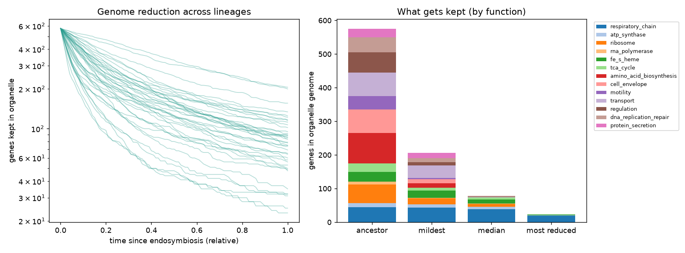
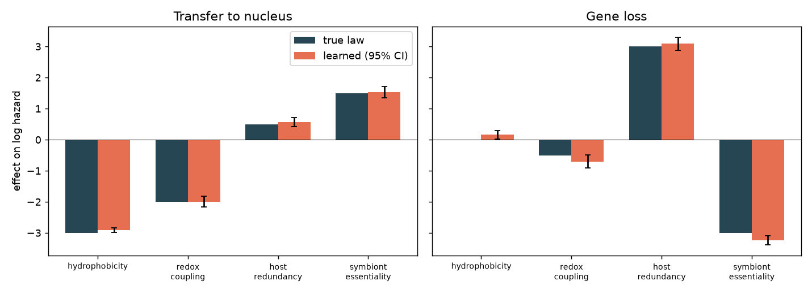
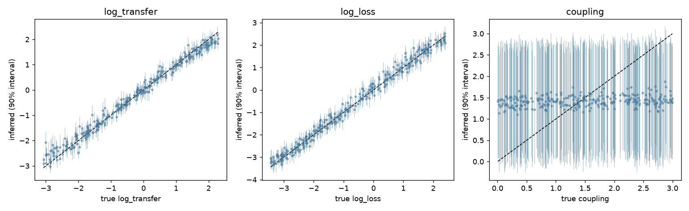
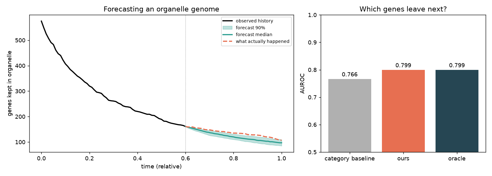
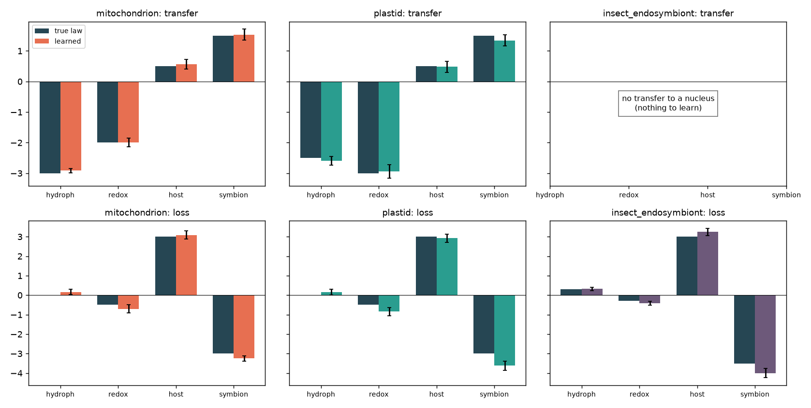
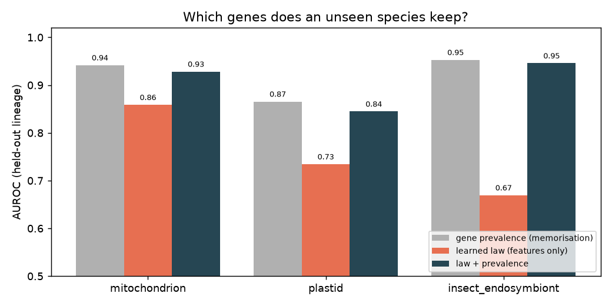

# organelle-evo

**공생 세균이 미토콘드리아가 되는 과정의 "진화 법칙"을 학습하고, 그 법칙으로 진화를 추론·예측하는 AI**

*Learning the laws of endosymbiont → mitochondrion evolution with simulation-based AI.*

약 20억 년 전, 한 알파프로테오박테리아가 고세균 숙주 안에 들어가 미토콘드리아가 되었습니다.
그 과정에서 수천 개였던 유전자는 사라지거나(**소실**) 숙주 핵으로 옮겨졌고(**내공생 유전자 전달, EGT**),
사람 mtDNA에는 단백질 유전자가 13개만 남았습니다. 그런데 **왜 하필 그 유전자들이 남았을까요?**

이 프로젝트는 그 질문을 머신러닝 문제로 바꿉니다.

| 단계 | 질문 | 방법 |
|---|---|---|
| **① 법칙 학습** | 어떤 유전자 특성이 전달·소실을 결정하는가? | 경쟁위험 생존모형의 최대우도 추정(해석 가능한 계수 + 부트스트랩 신뢰구간) |
| **② 진화 추론** | 이 소기관 유전체 하나만 보고, 숨은 진화 역사를 알 수 있는가? | 시뮬레이션 기반 추론(SBI), 신경망 사후분포 추정 |
| **③ 진화 예측** | 지금 남아 있는 유전자 중 다음에 떠날 것은 무엇인가? | 추론된 사후분포 × 학습된 법칙 → 정방향 시뮬레이션 |

## 모델

### 조상 유전체 (`ancestor.py`)
기능 범주 13개(호흡사슬, ATP 합성효소, 리보솜, 아미노산 합성, 세포벽, 편모 등)에 걸친 575개 유전자로 이루어진 합성 조상입니다.
각 유전자는 문헌에 근거한 네 가지 특성을 가집니다.

- **hydrophobicity**: 막단백질은 핵으로 옮긴 뒤 다시 소기관으로 수입하기 어렵습니다 (*hydrophobicity hypothesis*)
- **redox_coupling**: 산화환원 상태에 맞춰 국소적으로 발현을 조절해야 하는 유전자입니다 (*CoRR hypothesis*, Allen)
- **host_redundancy**: 숙주가 이미 같은 기능을 제공하는 정도입니다
- **symbiont_essentiality**: 공생체에 여전히 필요한 정도입니다

### 진화 시뮬레이터 (`simulator.py`)
각 유전자는 `소기관 → 핵(전달)` 또는 `소기관 → 소실`의 비가역 경쟁위험 과정을 따릅니다.

```
log kT = log_transfer[계통] + x · w_T        (전달 법칙)
log kL = log_loss[계통]     + x · w_L        (소실 법칙)
kL    *= 1 + coupling · (같은 경로에서 이미 소실된 비율)   (경로 붕괴)
```

`w_T`, `w_L`은 모든 계통이 공유하는 **진화 법칙**이고, `log_transfer`, `log_loss`, `coupling`은 계통마다 다른 **숨은 역사**입니다.

## 결과

`python scripts/run_pipeline.py` 실행 결과입니다. CPU로 약 4분 걸리고, 수치는 `results/metrics.json`에 저장됩니다.

### 0. 유전체 축소가 재현됩니다


가장 많이 축소된 계통에는 **호흡사슬 유전자만** 남습니다. 이 결과는 따로 지정한 것이 아니라 법칙에서 저절로 나왔고, 실제 동물 mtDNA와 같은 패턴입니다.

### ① 결과(최종 유전자 상태)만 보고 법칙을 되찾습니다


40개 계통의 최종 상태만으로 8개 법칙 계수를 모두 부호까지 맞게 복원했습니다. 참값과의 차이는 대부분 0.25 이내입니다.
학습기는 경로 붕괴(coupling)를 모르는, 일부러 틀리게 설정된(misspecified) 모형인데도 결과가 견고합니다.
소실 법칙의 `redox_coupling` 계수가 약간 과대추정되는 것이 그 편향의 흔적입니다.

### ② 유전체 하나로 숨은 역사를 추정합니다


| 파라미터 | R² | 90% 구간 적중률 |
|---|---|---|
| log_transfer (숙주 전달 압력 × 시간) | 0.98 | 0.84 |
| log_loss (소실 압력 × 시간) | 0.99 | 0.90 |
| coupling (경로 붕괴) | 0.06 | 0.91 |

**발견:** 경로 붕괴 강도는 최종 스냅샷만으로는 **식별할 수 없습니다.** 모델은 억지로 추측하지 않고, 사후분포를 사전분포만큼 넓게 유지해 "모른다"고 정직하게 답합니다(적중률 0.91).
마찬가지로 이 모델 구조에서는 **압력과 시간이 곱으로만 나타나서**, 유전체 하나만으로는 "강한 압력"과 "긴 시간"을 구별할 수 없습니다.
어떤 추가 데이터(화석 기반 연대, 다중 시점 관측 등)가 필요한지 알려준다는 점에서 이것도 의미 있는 결과입니다.

### ③ 미래를 예측합니다


본 적 없는 200개 계통을 진화 역사의 60% 시점에서 관측하고, 나머지 40% 동안 일어날 일을 예측했습니다.

| 모델 | "어떤 유전자가 다음에 떠날까" AUROC |
|---|---|
| 범주 기반 기준선 | 0.766 |
| **본 모델** (학습된 법칙 + 추론된 역사) | **0.799** |
| 오라클 (참 법칙 + 참 파라미터) | 0.799 |

최종 소기관 유전자 수는 평균 오차 5.4개로 맞혔고, 90% 예측구간 적중률은 0.94입니다.
본 모델은 참값을 전부 아는 오라클과 같은 성능을 냈습니다. 남은 오차는 진화 자체의 확률성에서 오는 것이므로, 이 과제에서 도달할 수 있는 상한에 도달한 셈입니다.

## 다른 공생 소기관과 미생물로 확장

같은 틀을 세 가지 내공생 시스템에 적용했습니다(`systems.py`, `scripts/run_systems.py`).

| 시스템 | 조상 → 숙주 | 특징 |
|---|---|---|
| 미토콘드리아 | 알파프로테오박테리아 → 고세균 | 유전자 전달과 소실이 모두 일어남 |
| 색소체(엽록체, 시아넬, 아피코플라스트) | 시아노박테리아 → 진핵생물 | 광합성 전자전달계 때문에 산화환원 결합(CoRR)의 제동 효과가 가장 강함 |
| 곤충 내공생세균(Buchnera 등) | 감마프로테오박테리아 → 곤충 균세포 | 숙주 핵으로 가는 경로가 없어 **소실만** 일어남. 숙주 먹이에 부족한 영양소(필수 아미노산, 비타민) 합성 유전자는 남음 |



세 시스템 모두 학습기가 각자의 법칙을 복원합니다. 곤충 내공생세균은 유전자 전달이 전혀 관측되지 않으므로, 학습기는 전달 법칙을 추정하지 않습니다.

## 실제 유전체 데이터

`realdata/` 패키지는 NCBI에서 실제 유전체를 받아 같은 방식으로 학습합니다.

1. **수집** (`scripts/fetch_data.py`, GitHub Actions `fetch-data.yml`로 자동 실행): 미토콘드리아 30종(자코바이드 → 식물 → 균류 → 동물 → *Plasmodium*), 색소체 21종(시아넬, 홍조류, 녹색식물, 기생식물 *Epifagus*, 아피코플라스트, 독립적 1차 공생인 *Paulinella* 크로마토포어), 곤충 내공생세균 12종(*Serratia symbiotica* → *Buchnera*). 곤충 내공생세균의 조상 대리로는 자유생활 근연종 *E. coli* K-12(유전자 4,277개)를 씁니다. `/gene`이 없는 오래된 기록은 `/product` 설명에서 유전자 기호를 추론합니다.
2. **특성**은 실제 단백질 서열에서 직접 계산합니다. Kyte-Doolittle 소수성(GRAVY), 막관통 나선 수, 단백질 길이, 기능군(전자전달 핵심, ATP 합성효소, 번역, 전사, 단백질 표적화)입니다.
3. **학습**: 실제 유전체에서는 빠진 유전자가 핵으로 갔는지 사라졌는지 구별하기 어렵습니다. 그래서 "소기관을 떠나는" 결합 위험도 하나를 학습합니다(보존 확률 = exp(−exp(a + x·w))).
4. **검증**: 한 종을 빼고 학습한 뒤, 그 종이 **몇 개**를 남겼는지만 주고 **어떤** 유전자를 남겼는지 예측합니다(leave-one-lineage-out AUROC). 기준선은 다른 종에서의 유전자 보존 빈도입니다.
5. **보편성 검정**: 한 법칙으로 세 시스템을 모두 설명하는 모델과 시스템마다 법칙을 따로 두는 모델을 AIC로 비교합니다.
6. **예측**: 각 종이 지금보다 50% 더 진화했을 때 몇 개의 유전자가 남고, 다음에 어떤 유전자가 떠날지 예측합니다(`results/real/forecasts.md`).

```bash
python scripts/fetch_data.py      # eutils.ncbi.nlm.nih.gov 접근 필요
python scripts/run_realdata.py    # → results/real/
```

### 실제 데이터 결과 (유전체 63개)


**1. 세 시스템이 공유하는 법칙.** 전자전달 핵심 유전자(nad/cox/cob, psa/psb/pet, nuo/cyo), ATP 합성효소, 번역 장치(리보솜 단백질, EF-Tu)는 세 시스템 모두에서 뚜렷하게 **남는** 쪽입니다. 숙주가 누구든, 공생체 안에서 에너지를 만들고 그 단백질을 번역하는 핵심은 끝까지 남습니다.

**2. 시스템마다 다른 법칙.** 하나의 법칙으로 세 시스템을 설명하는 모델은 시스템별 모델보다 훨씬 나쁩니다(ΔAIC = 799). 가장 큰 차이는 다음 두 가지입니다.
- **전사(RNA 중합효소, rpo):** 미토콘드리아에서는 **잃는** 쪽(+0.68)이지만, 색소체에서는 가장 강하게 **남는** 쪽(−2.46)입니다. 실제로 거의 모든 진핵생물의 미토콘드리아는 세균형 RNA 중합효소를 버리고 파지형 효소로 대체했고(자코바이드만 예외), 엽록체는 세균형 중합효소(PEP)를 유지합니다. 모델이 이 차이를 데이터만으로 찾아냈습니다.
- **소수성과 막관통 나선:** 미토콘드리아에서만 보존 효과가 있습니다(막관통 −0.51 ± 0.27). 핵으로 옮겨 갈 경로가 없는 곤충 내공생세균에서는 효과가 없거나 반대입니다. "소수성 단백질은 핵으로 옮긴 뒤 다시 수입하기 어려워 남는다"는 소수성 가설과 맞아떨어집니다. 이 효과는 핵으로의 전달이 있을 때만 의미가 있기 때문입니다. 반면 색소체에서는 뚜렷한 효과가 없어서, 가설이 모든 소기관에 똑같이 적용되지는 않음을 보여줍니다.
- 미토콘드리아에서는 단백질 표적화/시토크롬 c 생합성(ccm, tat, sec) 유전자가 빨리 사라집니다(+0.81).

**3. 처음 보는 종 예측하기.** 한 종을 빼고 학습한 뒤, 그 종이 몇 개를 남겼는지만 알려주고 어떤 유전자를 남겼는지 맞히게 했습니다.



유전자 이름을 전혀 보지 않고 특성만 쓰는 법칙으로도 AUROC 0.86(미토콘드리아)을 얻었습니다. 하지만 "다른 종에서 이 유전자가 얼마나 자주 남았나"를 외우는 기준선이 더 강하고, 둘을 합쳐도 나아지지 않습니다. **정직한 해석:** 현재 8개 특성은 일반 원리를 잘 담지만, 유전자별 사정(구체적인 단백질 복합체 조립 방식 등)까지 설명하지는 못합니다. 대신 법칙은 처음 보는 유전자에도 적용할 수 있습니다.

**4. 미래 예측 (`results/real/forecasts.md`).** 예를 들어 사람 mtDNA(13개)는 50% 더 진화하면 약 10개(90% 구간 8–12개)가 남고, 다음으로 사라질 가능성이 가장 높은 유전자는 **atp8**(64%)입니다. atp8은 가장 작은 mtDNA 단백질이고, 실제로 예쁜꼬마선충과 클라미도모나스 등 여러 계통에서 이미 사라졌습니다. 이 수치는 학습된 법칙을 연장한 투영이며, 검증된 예측이 아닙니다.

주의할 점:
- 모든 계통에서 사라진 유전자는 관측되지 않습니다. 미토콘드리아와 색소체에서는 가장 유전자가 많은 유전체들의 합집합이 조상을 대신합니다.
- 계통들은 계통수를 공유하므로 독립이 아닙니다.
- Kyte-Doolittle 막관통 예측은 조잡한 편이라 실제 나선 수를 과소평가합니다.
- 유전자는 이름으로만 대응시킵니다(상동성 검색 없음). 곤충 내공생세균 기록 중 유전자 기호가 없는 CDS는 "없음"으로 처리되어 소실이 과대평가될 수 있습니다. 같은 이유로 *Sodalis*는 제외했습니다(기록의 약 7%만 이름이 있음).
- *Plasmodium* 미토콘드리아 RefSeq 기록(NC_037526)은 cob을 "cytochrome oxidase I"로 잘못 주석해서 유전자가 2개로 잡힙니다. 데이터는 손으로 고치지 않았습니다.

## 실행

```bash
pip install -e ".[dev]"
python scripts/run_pipeline.py          # 전체 실험 → results/
python scripts/run_pipeline.py --quick  # 빠른 확인
pytest                                  # 시뮬레이터가 해석해와 일치하는지, 법칙이 복원되는지 등 검증
```

## 구조

```
src/organelle_evo/
  ancestor.py    합성 알파프로테오박테리아 조상 유전체
  simulator.py   정방향 모델 (벡터화된 경쟁위험 + 경로 붕괴)
  rules.py       ① 법칙 학습 (PyTorch MLE, 부트스트랩 CI)
  inference.py   ② 신경망 사후분포 추정 (SBI)
  predict.py     ③ 예측, 기준선, AUROC
  systems.py     미토콘드리아 / 색소체 / 곤충 내공생세균 시스템 정의
  realdata/      NCBI 수집, GenBank 파싱, 서열 특성, 실제 데이터 분석
  plots.py
scripts/run_pipeline.py, run_systems.py, fetch_data.py, run_realdata.py
tests/
```

## 한계와 다음 단계

- **실제 데이터 적용**: NCBI Organelle RefSeq의 미토콘드리아 유전자 목록(Reclinomonas ~ 인간 ~ Plasmodium)과 α-프로테오박테리아 오솔로그 특성(막관통 도메인 예측 = 소수성 등)을 연결해, 실제 진핵생물 계통으로 법칙을 학습합니다.
- **계통수 구조**: 현재는 계통들이 독립적이지만, 실제로는 계통수를 공유합니다. 조상 상태를 공유하는 트리 위 CTMC로 확장합니다.
- **신경망 위험 함수**: 선형 법칙을 신경망 hazard로 확장하고, 기호 회귀(symbolic regression)로 학습된 법칙을 다시 수식으로 뽑아냅니다.
- **식별성 개선**: 다중 시점 관측이나 핵 내 NUMT(최근 전달 흔적)를 추가 관측으로 넣어 coupling과 시간을 분리합니다.
- **다른 공생 소기관**: 엽록체, 하이드로게노솜, 곤충 공생세균(Buchnera 등)으로 일반화합니다.
